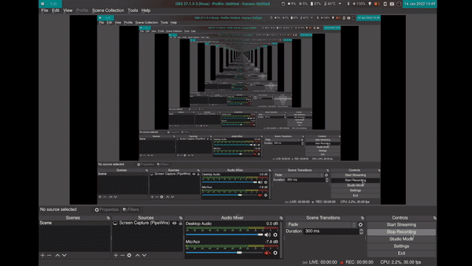

# sway-bg-blur
 Blur Sway background image when there's an focused window  
 
 Preview:  
 
 

 Since Sway does not support continuous transition between different backgrounds, I had to run 6 `swaybg` processes at the same time, and kill them one by one to achieve a continuous switching animation. Please feel free to let me know if you have better workaround tricks. 
